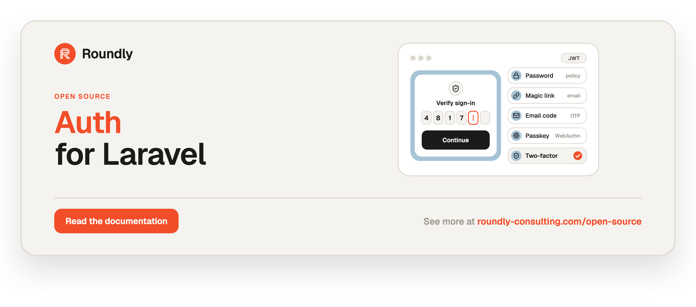

<!-- roundly-hero:start -->
<p align="center">
  <a href="https://roundly-consulting.com/open-source/docs/auth-for-laravel?utm_source=github&utm_medium=readme&utm_campaign=open-source&utm_content=auth-for-laravel">
    
  </a>
</p>
<!-- roundly-hero:end -->

<!-- roundly-badges:start -->
<p align="center">
  <a href="https://packagist.org/packages/roundly-consulting/auth-for-laravel"></a>
  <a href="https://github.com/roundly-consulting/auth-for-laravel/actions/workflows/run-tests.yml"></a>
  <a href="https://github.com/roundly-consulting/auth-for-laravel/actions/workflows/fix-php-code-style-issues.yml"></a>
  <a href="https://donate.stripe.com/dRmeVe8FX5PF1Qd9pXcEw00"></a>
  <a href="https://www.patreon.com/cw/roundly"></a>
  <a href="https://roundly-consulting.com/support-us?utm_source=github&utm_medium=readme&utm_campaign=open-source&utm_content=auth-for-laravel#crypto"></a>
</p>
<!-- roundly-badges:end -->

# Auth for Laravel

Headless, multi-guard account authentication for Laravel: password, magic-link, email-code
and passkey login; a multi-step challenge engine for two-factor, passkey second factors and
forced enrolment; RS256 access tokens with rotating refresh tokens and device sessions;
registration and invitations; email verification and verified email change; forgot / reset /
change password with a policy and an optional breached-password check; locale handling; a
login-activity log with throttling, lockout, new-device and risk hooks; events for every state
change; and opt-in JSON endpoints.

It owns no cryptography and no token format. It composes the roundly security packages —
access tokens are [`jwt-for-laravel`](https://github.com/roundly-consulting/jwt-for-laravel),
refresh tokens and sessions are
[`refresh-tokens-for-laravel`](https://github.com/roundly-consulting/refresh-tokens-for-laravel),
TOTP and recovery codes are
[`two-factor-for-laravel`](https://github.com/roundly-consulting/two-factor-for-laravel),
WebAuthn is [`passkeys-for-laravel`](https://github.com/roundly-consulting/passkeys-for-laravel),
every random value / digest / HMAC / constant-time compare is
[`crypto-for-laravel`](https://github.com/roundly-consulting/crypto-for-laravel) and the TOTP
setup QR code is [`qr-for-laravel`](https://github.com/roundly-consulting/qr-for-laravel). What
this package owns is **policy and orchestration**: which factors a login needs, how state moves
between steps, what is invalidated when, and what the client sees.

- [Requirements](#requirements)
- [Installation](#installation)
- [Configuration](#configuration)
- [Usage](#usage)
- [HTTP API](#http-api)
- [Events](#events)
- [Notifications](#notifications)
- [Middleware](#middleware)
- [Commands](#commands)
- [Testing helpers](#testing-helpers)
- [Security notes](#security-notes)
- [Testing](#testing)

## Requirements

- PHP 8.4, Laravel 12 or 13
- `ext-bcmath` and `ext-mbstring` (required transitively by `qr-for-laravel` and its
  `money-for-laravel` dependency), `ext-openssl`
- An RSA key pair for `jwt-for-laravel` (`php artisan jwt:keys`)
- A cache store with atomic locks (rate limits, re-authentication markers, the jti denylist)
- A mail transport, and — for `notifications.delivery = queue` — a real queue
- Laravel's `TrustProxies` configured when behind a proxy (IP-keyed limits read `$request->ip()`)
- `app.timezone = UTC` is recommended (stored times follow the app timezone)

## Installation

```bash
composer require roundly-consulting/auth-for-laravel
php artisan authentication:install
php artisan migrate
```

`authentication:install` publishes `authentication-config`, `authentication-migrations`,
`refresh-tokens-migrations`, `two-factor-migrations` and `passkeys-migrations`, and prints the
wiring below. The package never edits your config files. Publish tags:

| Tag | What |
|---|---|
| `authentication-config` | `config/authentication.php` |
| `authentication-migrations` | the four package tables + the columns stub for the default guard's table |
| `authentication-translations` | `lang/vendor/authentication` (error messages, notification copy) |

Wire each guard in `config/auth.php` — a `jwt` guard with **its own audience**, and the
`authentication` user provider:

```php
'guards' => [
    'users'   => ['driver' => 'jwt', 'provider' => 'users',   'audience' => env('JWT_USERS_AUDIENCE', 'app-users')],
    'clients' => ['driver' => 'jwt', 'provider' => 'clients', 'audience' => env('JWT_CLIENTS_AUDIENCE', 'app-clients')],
],
'providers' => [
    'users'   => ['driver' => 'authentication', 'guard' => 'users'],
    'clients' => ['driver' => 'authentication', 'guard' => 'clients'],
],
```

…and in `config/jwt.php` make every jwt guard use the token-version resolver (without it,
invalidation revokes nothing):

```php
'guard' => [
    'token_version' => \RoundlyConsulting\Auth\Support\TokenVersionResolver::class,
    // …
],
```

Your guard model implements the contracts of the features the guard uses:

```php
use Illuminate\Foundation\Auth\User as Authenticatable;
use Illuminate\Notifications\Notifiable;
use RoundlyConsulting\Auth\Concerns\HasAuthentication;
use RoundlyConsulting\Auth\Contracts\Account;
use RoundlyConsulting\Passkeys\Concerns\InteractsWithPasskeys;
use RoundlyConsulting\Passkeys\Contracts\HasPasskeys;
use RoundlyConsulting\RefreshTokens\Traits\HasRefreshTokens;
use RoundlyConsulting\TwoFactor\Concerns\HasTwoFactorAuthentication;
use RoundlyConsulting\TwoFactor\Contracts\TwoFactorAuthenticatable;

class User extends Authenticatable implements Account, HasPasskeys, TwoFactorAuthenticatable
{
    use HasAuthentication, HasRefreshTokens, HasTwoFactorAuthentication, InteractsWithPasskeys, Notifiable;

    protected function casts(): array
    {
        return [...$this->authenticationCasts(), ...$this->twoFactorCasts(), 'email_verified_at' => 'datetime'];
    }
}
```

The published stub adds the authentication columns to the default guard's table. Every other
guard table calls `$table->authenticationColumns()` (plus `$table->twoFactorColumns()` and
`$table->passkeyUserHandle()` when those features are on) — `php artisan authentication:guard
clients` scaffolds the model, migration and factory for you.

Finally, run the doctor:

```bash
php artisan authentication:check
```

## Configuration

`config/authentication.php`. Top-level keys are global. Everything under `defaults` is **per
guard** and can be overridden in `guards.<name>` — associative arrays merge recursively, **lists
replace wholesale** (`identifier.columns = ['username']` replaces `['email']`, it does not merge
by index).

```php
'guards' => [
    'users' => ['model' => App\Models\User::class],
    'clients' => [
        'model' => App\Models\Client::class,
        'login' => ['password' => false, 'magic_link' => true, 'passkey' => true],
        'two_factor' => ['mode' => 'off'],
        'passkeys' => ['mode' => 'optional', 'second_factor' => 'off'],
        'registration' => ['mode' => 'open'],
        'routes' => ['enabled' => true, 'prefix' => 'clients/auth'],
    ],
],
```

Every guard is isolated: own model and table, own JWT audience, own refresh-token owner type,
own throttle keys, own activity rows, own routes. Two guards may not share a model (a role on
one table is authorization, not a guard) or an audience.

### Global keys

| Key | Default | Env | Purpose |
|---|---|---|---|
| `default` | `users` | `AUTHENTICATION_GUARD` | guard used by `Authentication::guard()` without a name |
| `key_type` | `bigint` | `AUTHENTICATION_KEY_TYPE` | PK type of every guard model (`bigint`, `uuid`, `ulid`); must equal `passkeys.key_type` and `refresh-tokens.key_type` |
| `hash_key` | derived from `APP_KEY` | `AUTHENTICATION_HASH_KEY` | HMAC key for links, codes, challenge tokens, fingerprints, throttle keys; rotating it invalidates every outstanding secret |
| `tables.challenges` … `tables.login_activities` | `auth_*` | `AUTHENTICATION_*_TABLE` | table names |
| `models.challenge`, `.one_time_token`, `.invitation`, `.login_activity` | packaged models | — | swappable models (must extend the packaged ones) |
| `columns.*` | same-named | — | column names on every guard table (`token_version`, `locale`, `timezone`, `password`, `password_changed_at`, `email_verified_at`, `last_login_at`, `disabled_at`, `disabled_reason`, `locked_until`, `failed_login_count`) |
| `reauthentication_store` | default store | `AUTHENTICATION_REAUTH_STORE` | cache store for "recently re-authenticated" markers |

### Per-guard keys (`defaults.*`)

| Key | Default | Purpose |
|---|---|---|
| `model` | — (required) | `class-string<Model&Account>` |
| `laravel_guard` | guard name | the `auth.guards` entry (a `jwt` guard) this guard authenticates with |
| `identifier.columns` | `['email']` | columns accepted as the login identifier, tried in order |
| `identifier.email_column` | `email` | the address column — also where `HasAuthentication` routes mail (`routeNotificationForMail()`) |
| `identifier.normalize` | `lowercase` | `lowercase` or `none`; emails are stored and looked up normalised (always Unicode-composed, NFC) |
| `identifier.case_insensitive_lookup` | `false` | `lower(col) = ?` for legacy mixed-case rows (index-hostile) |
| `login.password` / `.magic_link` / `.email_otp` / `.passkey` | `true` / `false` / `false` / `false` | login methods (env `AUTHENTICATION_LOGIN_*`) |
| `login.reveal_account_state` | `true` | disabled/unverified codes after a verified first factor; `false` makes them `invalid_credentials` |
| `challenge.ttl` / `.enrolment_ttl` | `300` / `900` | challenge lifetime (the longer one when an enrolment step is pending) |
| `challenge.max_attempts` | `5` | failed steps before the challenge dies |
| `challenge.allow_enrolment` | `true` | allow forced enrolment inside a challenge |
| `challenge.enrolment_requires_verified_email` | `true` | …only for verified addresses |
| `challenge.bind.user_agent` / `.ip` / `.device_header` | `true` / `false` / `true` | device binding of a challenge |
| `challenge.max_active_per_account` | `3` | older active challenges are superseded |
| `two_factor.mode` | `optional` | `off`, `optional`, `required` (env `AUTHENTICATION_TWO_FACTOR`) |
| `two_factor.after_email_login` | `true` | magic link / email code / invitation also need the second factor |
| `two_factor.required_with_passkey` | `false` | a passkey primary still forces TOTP enrolment under `required` |
| `two_factor.passkey_satisfies_required` | `true` | a passkey second factor satisfies `required` |
| `two_factor.issuer` | `null` | otpauth issuer for this guard (null → two-factor's issuer / app name) |
| `two_factor.qr.enabled` / `.size` | `true` / `240` | TOTP setup QR code |
| `passkeys.mode` | `optional` | `off`, `optional`, `required` (env `AUTHENTICATION_PASSKEYS`) |
| `passkeys.second_factor` | `allowed` | `off`, `allowed`, `required_when_enrolled`, `required` |
| `passkeys.satisfies_mfa` | `true` | a user-verified passwordless passkey login needs no further factor (UV is then enforced per ceremony) |
| `tokens.access_ttl` | `null` | seconds; null → `jwt.ttl` |
| `tokens.refresh_ttl` / `.refresh_absolute_ttl` | 30 / 90 days | sliding and absolute refresh lifetime (0 = no cap) |
| `tokens.claims_resolver` | `DefaultClaimsResolver` | `ResolvesAccessTokenClaims` implementation |
| `tokens.include_email` | `true` | `email` / `email_verified` claims |
| `sessions.max_active` | `null` | oldest sessions revoked above the cap |
| `invalidation.password_changed` / `.password_reset` / `.email_changed` / `.two_factor_changed` / `.passkey_changed` | `others` / `all` / `others` / `others` / `none` | `none`, `others`, `all` (disable, logout-everywhere and incidents are always `all`) |
| `registration.mode` | `closed` | `open`, `invite_only`, `closed` (env `AUTHENTICATION_REGISTRATION`); `closed` also refuses accepting invitations — use `invite_only` for invitation-only sign-up |
| `registration.require_password` | `true` | when password login is on |
| `registration.login_after` | `true` | sign in right after registering |
| `registration.rules` | `null` | `ProvidesRegistrationRules` for host fields (only those keys reach the creator) |
| `registration.creator` | `CreateAccount` | `CreatesAccounts` implementation |
| `invitations.enabled` | `false` | invitations (`invite_only` requires it) |
| `invitations.ttl` | 7 days | invitation lifetime |
| `invitations.lock_email` | `true` | the invitee must use the invited address |
| `invitations.replace_pending` | `true` | a new invitation revokes the pending one for the address |
| `invitations.allow_existing_email` | `false` | invite addresses that already have an account |
| `invitations.resend_cooldown` / `.max_sends` | `60` / `5` | resend limits |
| `invitations.preview_payload_keys` | `[]` | payload keys the preview endpoint shows |
| `invitations.ability` | `authentication.invitations.manage` | Gate ability for the management routes |
| `verification.mode` | `optional` | `off`, `optional`, `required_for_actions`, `required_for_login` (env `AUTHENTICATION_VERIFICATION`) |
| `verification.channel` | `link` | `link` or `code` |
| `verification.ttl` / `.code_length` / `.max_attempts` | 1 day / 6 / 5 | verification secrets |
| `verification.resend_decay` | `60` | per-account resend cooldown |
| `verification.verify_on_email_login` | `true` | a magic-link / email-code login verifies the address |
| `email_change.enabled` / `.ttl` / `.notify_old` / `.require_reauthentication` | `true` / 1 h / `true` / `true` | verified email change (`.require_reauthentication = false` drops its gate; otherwise `required_for` decides) |
| `magic_link.ttl` / `.same_device` | 15 min / `false` | magic links (same-device binds to the requesting device) |
| `email_otp.ttl` / `.length` / `.max_attempts` | 10 min / 6 / 5 | email codes (also re-authentication codes) |
| `passwords.reset.enabled` / `.ttl` / `.login_after` | `true` / 1 h / `false` | password reset |
| `passwords.change.enabled` | `true` | change password endpoint |
| `passwords.rehash_on_login` | `true` | upgrade hashes on login |
| `passwords.policy.min` / `.max` | `10` / `128` | length (72 bytes max under bcrypt, enforced) |
| `passwords.policy.letters` / `.mixed_case` / `.numbers` / `.symbols` | `false` | composition rules |
| `passwords.policy.not_identifier` | `true` | must not contain the email's local part |
| `passwords.policy.uncompromised.enabled` / `.threshold` / `.timeout` / `.fail_closed` | `false` / `0` / `3` / `false` | breached-password check (env `AUTHENTICATION_PASSWORD_BREACH_CHECK`) |
| `throttle.<kind>.max` / `.decay` | see config | `login`, `login_ip`, `login_account`, `email_request`, `email_request_ip`, `email_request_account`, `refresh`, `registration`, `verification`, `reauthentication` |
| `lockout.enabled` / `.threshold` / `.duration` / `.reset_unlocks` | `false` / `10` / `900` / `true` | opt-in hard lock |
| `reauthentication.timeout` | `900` | how long a re-authentication counts |
| `reauthentication.methods` | all five | allowed methods |
| `reauthentication.require_second_factor_when_enrolled` | `true` | accounts with a second factor must use it — to re-authenticate, and for a re-authentication or fresh login to satisfy a gate (checked against the factors the account has *now*) |
| `reauthentication.fresh_login_counts` | `true` | a login within the window counts — for an account with a second factor, only a login that used it (`amr` has `mfa` or `hwk`) |
| `reauthentication.required_for` | all eight actions | `SensitiveAction` values that need a recent re-authentication; remove one to drop its gate (`set_password` = a passwordless account setting a first password) |
| `activity.enabled` / `.store_identifier` / `.retention_days` | `true` / `plain` / `90` | login-activity log (`plain`, `hash`, `none`) |
| `activity.new_device.enabled` / `.header` / `.skip_first_login` | `true` / `X-Device-Id` / `true` | new-device detection |
| `risk.assessor` / `.reactions.elevated` / `.reactions.high` / `.deny_response` | `null` / `notify` / `require_second_factor` / `uniform` | risk hooks |
| `locale.header` / `.supported` / `.store_on_registration` / `.fill_on_login` / `.timezone` | `X-Locale` / `[app.locale]` / `true` / `true` / `true` | locale & timezone |
| `notifications.delivery` / `.connection` / `.queue` | `after_response` / null / null | `sync`, `after_response`, `queue` (env `AUTHENTICATION_NOTIFICATION_*`) |
| `notifications.classes.*` | packaged classes | 18 notification classes; `null` disables one |
| `notifications.frontend_url` | `app.url` | `{frontend}` in URL templates (env `AUTHENTICATION_FRONTEND_URL`) |
| `notifications.urls.*` | `{frontend}/auth/…?guard={guard}#token={token}` | emailed link templates (env `AUTHENTICATION_URL_*`) |
| `routes.enabled` / `.prefix` / `.name` / `.middleware` / `.authenticated_middleware` / `.invitations_management` | `false` / `{guard}/auth` / `authentication.{guard}.` / `['api']` / `[]` / `false` | opt-in routes |
| `resources.account` | `AccountResource` | the `me` resource |

## Usage

### The facade

`Authentication::guard('clients')` is one guard's API. Every other per-guard method on the
facade runs on the default guard (`authentication.default`), so
`Authentication::twoFactor()->status($user)` is `Authentication::guard()->twoFactor()->status($user)`.

```php
use RoundlyConsulting\Auth\DataTransferObjects\PasswordCredentials;
use RoundlyConsulting\Auth\Facades\Authentication;
use RoundlyConsulting\Auth\Http\Resources\ChallengeResource;
use RoundlyConsulting\Auth\Http\Resources\TokenPairResource;

$guard = Authentication::guard('clients');

$result = $guard->attempt(
    new PasswordCredentials(identifier: $request->string('email')->toString(), password: $request->string('password')->toString()),
    $guard->contextFrom($request),
);

return $result->isAuthenticated()
    ? TokenPairResource::make($result->tokens)
    : ChallengeResource::make($result->challenge);   // continue with $guard->challenges()->complete(…)

Authentication::twoFactor()->status($user);          // enabled, pending, recovery codes left, mode
Authentication::passwords()->set($user, 'n3w-Passphrase!', InvalidationReason::Security);
Authentication::invitations()->create(new InvitationData('ada@example.com'))->url;
Authentication::lock($user, seconds: 3600);
```

Core verbs sit on the guard itself:

| Method | Returns |
|---|---|
| `attempt(PasswordCredentials, SessionContext)` | `LoginResult` (tokens or challenge) |
| `requestMagicLink($email, $ctx)` / `consumeMagicLink($token, $ctx)` | `void` / `LoginResult` |
| `requestEmailOtp($email, $ctx)` / `verifyEmailOtp($email, $code, $ctx)` | `void` / `LoginResult` |
| `passkeyLoginOptions($ctx)` / `loginWithPasskey($response, $ctx)` | `RequestOptionsData` / `LoginResult` |
| `register(RegistrationData)` | `RegistrationResult` |
| `issueTokens($account, $ctx, $method, $amr)` | `TokenPair` — host-vouched login (impersonation, SSO); fires `TokensIssued` |
| `refresh($refreshToken, $ctx)` | `TokenPair` |
| `sessions($account, $currentSessionId)` | `Collection<SessionData>` |
| `logout($account, $current)` / `logoutSession($account, $id)` / `logoutOthers($account, $current)` / `logoutEverywhere($account)` | — / — / `int` / `int` |
| `invalidate($account, InvalidationReason, ?$keep, ?$ctx)` | `?TokenPair` (the re-issued pair under `others`) |
| `disable($account, ?$reason)` / `enable($account)` | — |
| `lock($account, ?$seconds)` / `unlock($account)` | `CarbonImmutable` / — (a lock notifies the owner, never logs out) |
| `updateLocale($account, LocaleData)` | `Account` |
| `activity($account, $perPage = 20)` | paginated own `LoginActivity` |
| `contextFrom(Request)` / `tokenFrom(Request)` | `SessionContext` / `CurrentToken` |
| `name()` / `config()` / `accounts()` | `string` / `GuardConfig` / `AccountRepository` |

Each area has a sub-context:

| Sub-context | Methods |
|---|---|
| `twoFactor()` | `status($a)`, `start($a)`, `confirm($a, $code, ?$current, ?$ctx)`, `disable($a, ?$current, ?$ctx)`, `regenerateRecoveryCodes($a, ?$current, ?$ctx)` |
| `passkeys()` | `all($a)`, `registrationOptions($a)`, `register($a, $response, ?$name, ?$current, ?$ctx)`, `rename($a, Passkey\|int, $name)`, `remove($a, Passkey\|int, ?$current, ?$ctx)` |
| `passwords()` | `set($a, $password, $reason)`, `change($a, ChangePasswordData)`, `requestReset($email, $ctx)`, `reset(PasswordResetData)`, `validate($password, ?$a, ?$email)`, `rule(?$email)` |
| `email()` | `sendVerification($a, ?$ctx)`, `requestVerification($a, $ctx)`, `resendVerification($email, $ctx)`, `verify($tokenOrCode, ?$email, $ctx)`, `requestChange($a, EmailChangeData)`, `confirmChange($token, $ctx)` |
| `invitations()` | `create(InvitationData)` → `InvitationLink`, `accept(AcceptInvitationData)`, `paginate(?$status, $perPage)`, `preview($token)`, `find($id)`, `resend(Invitation\|int)`, `revoke(Invitation\|int)`, `link(Invitation\|int)` |
| `reauthentication()` | `methods($a)`, `sendCode($a, $ctx)`, `passkeyOptions($a, $current)`, `confirm($a, ReauthenticationData)`, `ensureRecent($a, $current, ?$seconds)`, `ensureFor(SensitiveAction, $a, $current)` |
| `challenges()` | `complete(ChallengeFactorData)`, `passkeyOptions($token, $ctx)`, `passkeyEnrolmentOptions($token, $ctx)`, `startTwoFactorEnrolment($token, $ctx)` |

Plus `Authentication::prune(?$days)`, `guards()`, `routes($guard)`, `currentGuard()`.

**Scoping.** Every method that takes an account refuses one of another guard's model
(`AuthenticationMisconfigured`, "belongs to another guard") before anything is written. Another
guard's invitation, passkey or challenge token is unknown (`InvitationNotFound`,
`PasskeyNotFound`, `ChallengeInvalid`).

**Acting for the signed-in user.** Pass the caller's token (`$guard->tokenFrom($request)`) as
`$current` to the credential changes: its device is kept under `others` and the re-issued pair
is returned — the client must swap to it. Leave `$current` out for admin and CLI calls. The HTTP
layer also demands a recent re-authentication before the actions in
`reauthentication.required_for`; PHP callers vouch for the user themselves, or run the same gate
first:

```php
$current = $guard->tokenFrom($request);

$guard->reauthentication()->ensureFor(SensitiveAction::DisableTwoFactor, $user, $current);
$tokens = $guard->twoFactor()->disable($user, $current, $guard->contextFrom($request));
```

(`passwords()->change()` runs the gate itself for an account that is setting its first password.)

**Use `Authentication::…`, not the lower packages' model methods.** Methods such as
`$user->disableTwoFactor()`, `$user->regenerateTwoFactorRecoveryCodes()`,
`Passkeys::for($user)->revoke()`, `$user->revokeAllSessions()` or
`RefreshTokens::sessions($user)->revokeAll()` change the credential but skip this package's
policy — the guard's mode, the invalidation, the events and the owner's notification.

### Without the facade

The facade is sugar over `RoundlyConsulting\Auth\AuthenticationManager` — inject it for the same
API — and every method runs one container-resolved action (`RoundlyConsulting\Auth\Actions\*`,
a single `execute()`), which you can also call directly:

```php
use RoundlyConsulting\Auth\Actions\Passwords\SetPassword;
use RoundlyConsulting\Auth\AuthenticationManager;

final class ResetSupportPassword
{
    public function __construct(private AuthenticationManager $authentication) {}

    public function __invoke(User $user, string $password): void
    {
        $this->authentication->guard('users')->passwords()->set($user, $password, InvalidationReason::Security);
    }
}

// The raw action — the same code path.
app(SetPassword::class)->execute('users', $user, $password, InvalidationReason::Security);
```

Rebinding an action in the container changes the facade too. Actions tagged `@internal` are
building blocks of the flows above, not API.

### Testing without a fake

There is no `Authentication::fake()` on purpose. Every write already fires a domain event —
assert them with `Event::fake()` — and the [testing helpers](#testing-helpers) issue REAL token
pairs, so a test runs through the guard, audience, denylist and token-version checks that a stub
would hide.

```php
Event::fake([PasswordChanged::class]);

Authentication::passwords()->set($user, 'n3w-Passphrase!');

Event::assertDispatched(PasswordChanged::class);
```

### Login challenges

When a first factor verifies but more is needed, the result is a challenge: an opaque token
(only its HMAC is stored), the steps that remain, and the attempts left. Steps complete in
order; verification steps always come before enrolment steps.

| Step | Methods | Endpoints |
|---|---|---|
| `second_factor` | `totp`, `recovery_code`, `passkey` | `challenge/two-factor`, `challenge/passkey/options` + `challenge/passkey` |
| `passkey` | `passkey` | `challenge/passkey/options` + `challenge/passkey` |
| `enrol_two_factor` | `totp_enrolment` | `challenge/two-factor/enrol` + `…/confirm` |
| `enrol_passkey` | `passkey_enrolment` | `challenge/passkey/enrol/options` + `challenge/passkey/enrol` |

Which steps a login needs depends on the guard's two-factor mode, passkey mode and passkey
second-factor rule, on what the account has enrolled, and on the risk reaction. A password reset
never bypasses an enrolled second factor. Access tokens carry `amr` (RFC 8176: `pwd`, `otp`,
`email`, `hwk`, `user`, `mfa`), `auth_time` and `sid` (the session id).

### Opt-in routes

```php
// routes/api.php
Authentication::routes('users')
    ->prefix('users/auth')
    ->middleware(['api'])
    ->except(['invitations.manage']);
```

or set `routes.enabled = true` for the guard. Groups for `only()` / `except()`: `login`,
`challenge`, `tokens`, `registration`, `invitations`, `passwords`, `email`, `account`,
`sessions`, `two-factor`, `passkeys`, `invitations.manage`. Registering a guard twice throws.

## HTTP API

Every route carries `authentication.guard:{guard}` and `Cache-Control: no-store`, and exists
only when its feature is enabled for the guard (a disabled feature is a 404). Tokens always
travel in request **bodies**. `*` = authenticated (`auth:{laravel_guard}`).

| Method | URI (under the prefix) | Purpose |
|---|---|---|
| POST | `login` | email/identifier + password |
| POST | `login/magic-link`, `login/magic-link/consume` | request / consume a magic link |
| POST | `login/otp`, `login/otp/verify` | request / verify an email code |
| POST | `login/passkey/options`, `login/passkey` | passwordless passkey login |
| POST | `challenge/two-factor` | TOTP or recovery code |
| POST | `challenge/two-factor/enrol`, `…/enrol/confirm` | forced TOTP enrolment |
| POST | `challenge/passkey/options`, `challenge/passkey` | passkey second factor |
| POST | `challenge/passkey/enrol/options`, `challenge/passkey/enrol` | forced passkey enrolment |
| POST | `refresh` | rotate the refresh token |
| POST | `register` | registration |
| POST | `invitations/preview`, `invitations/accept` | invitations |
| POST | `password/forgot`, `password/reset` | password reset |
| POST | `email/verify`, `email/verification/resend` | email verification |
| POST | `email/change/confirm` | confirm an email change (opened from the mail) |
| GET\* | `me` | the account |
| PATCH\* | `locale` | locale / timezone |
| POST\* | `reauthenticate`, `reauthenticate/passkey/options`, `reauthenticate/otp` | re-authentication |
| GET\* | `activity` | own login activity |
| POST\* | `logout`, `logout/others`, `logout/everywhere` | logouts |
| GET\* / DELETE\* | `sessions`, `sessions/{session}` | device sessions |
| PUT\* | `password` | change password |
| POST\* | `email/change`, `email/verification` | email change / send verification |
| GET\* POST\* DELETE\* | `two-factor`, `two-factor/confirm`, `two-factor/recovery-codes` | 2FA management |
| GET\* POST\* PATCH\* DELETE\* | `passkeys`, `passkeys/options`, `passkeys/{passkey}` | passkey management |
| GET\* POST\* DELETE\* | `invitations`, `invitations/{invitation}/resend`, `invitations/{invitation}` | invitation admin (Gate ability) |

Response shapes:

```jsonc
// 200 — authenticated
{ "status": "authenticated", "token_type": "Bearer", "access_token": "eyJ…", "expires_in": 900,
  "expires_at": "2026-09-26T10:15:00Z", "refresh_token": "…", "refresh_expires_at": "2026-10-26T10:00:00Z",
  "session_id": "0199…" }

// 200 — challenge
{ "status": "challenge", "challenge_token": "…", "expires_at": "…", "attempts_left": 5, "method": "password",
  "completed": [], "remaining": [ { "step": "second_factor", "methods": ["totp", "recovery_code", "passkey"] } ] }

// 202 — enumeration-safe acknowledgement (magic link, email code, forgot, resend, email change)
{ "status": "sent" }
```

Credential-change responses (`PUT password`, `POST two-factor/confirm`, `DELETE two-factor`,
`POST two-factor/recovery-codes`, `POST passkeys`, `DELETE passkeys/{passkey}`) include
`"tokens": {…}|null`. When non-null the client **must** swap to it immediately — its previous
access token died with the change.

Errors render as `{"message": "…", "code": "…", "errors": {…}}`:

| Code | Status | When |
|---|---|---|
| `invalid_credentials` | 422 | wrong credentials (uniform) |
| `invalid_token` / `invalid_code` | 422 | an emailed link / code is invalid (uniform) |
| `challenge_invalid` / `factor_failed` / `factor_not_allowed` | 422 | challenge problems (`attempts_left` on `factor_failed`) |
| `invalid_invitation` | 422 | an invitation is invalid (uniform) |
| `refresh_invalid` | 401 | the refresh token is invalid (uniform) |
| `too_many_attempts` | 429 | throttled or hard-locked (`Retry-After`) |
| `account_disabled` / `email_not_verified` / `enrolment_required` / `reauthentication_required` | 403 | account state / policy (`methods` on reauth) |
| `registration_closed` / `invitation_required` / `login_denied` | 403 | registration / risk |
| `account_locked` | 423 | a re-authenticating account is locked |
| `two_factor_required` / `last_credential` / `two_factor_already_enabled` / `two_factor_not_enabled` | 409 | refused changes |
| `method_disabled` / `not_found` | 404 | feature off / unknown id |
| `passkey_registration_failed` | 422 | a passkey did not register |
| a validation error on `password` | 422 | breached-password service down with `fail_closed` |
| `misconfigured` | 500 | configuration error (detail only with `app.debug`) |

## Events

All in `RoundlyConsulting\Auth\Events`, `final readonly`, carrying the guard name and never a
secret; models travel by identifier (`SerializesModels`) to queued listeners — hook your audit
log here: `LoginSucceeded`, `LoginFailed`, `LoginChallenged`,
`ChallengeStepCompleted`, `ChallengeFailed`, `LoginThrottled`, `MagicLinkRequested`,
`EmailOtpRequested`, `NewDeviceDetected`, `SuspiciousLoginDetected`, `TokensIssued`,
`TokensRefreshed`, `LoggedOut`, `AccountTokensInvalidated`, `RefreshTokenReuseReported`,
`AccountRegistered`, `AccountDisabled`, `AccountEnabled`, `AccountLocked`, `AccountUnlocked`,
`LocaleUpdated`, `Reauthenticated`, `PasswordResetRequested`, `PasswordReset`, `PasswordChanged`,
`PasswordRehashed`, `BreachedPasswordCheckFailed`, `EmailVerificationSent`, `EmailVerified`,
`EmailChangeRequested`, `EmailChanged`, `InvitationCreated`, `InvitationSent`,
`InvitationRevoked`, `InvitationAccepted` (read `$invitation->payload` to assign roles),
`TwoFactorEnabled`, `TwoFactorDisabled`, `RecoveryCodesRegenerated`, `RecoveryCodeUsed`,
`PasskeyAdded`, `PasskeyRemoved`, `LoginActivityRecorded` (ids only — enrich rows with
`LoginActivity::enrich($countryCode, $city)`).

```php
Event::listen(AccountRegistered::class, fn (AccountRegistered $event) => Statistics::increment('registrations'));
```

## Notifications

18 mail notifications in `RoundlyConsulting\Auth\Notifications` (magic link, email code,
verification, reset, password changed, email-change confirmation / requested / changed, account
exists, invitation, new device, 2FA enabled / disabled, recovery code used, passkey added /
removed, account locked, suspicious session). Swap one per guard with
`notifications.classes.<type>` (a subclass of `AuthenticationNotification`), or set it to `null`.
Copy lives in `authentication::notifications.*` — publish `authentication-translations` to
change it. Accounts get mail in their `locale` (via `preferredLocale()`).

Delivery defaults to **after the response** (a known account's response must not be slower than
an unknown one's). With `queue`, delivery goes through an encrypted job (`ShouldBeEncrypted`) —
the plaintext link or code never sits readable in the queue store. Links carry the secret in the
URL **fragment** by default (`#token=…`), so it never reaches a server log or a `Referer` header;
the frontend reads `location.hash` and POSTs the token. Do not use the `log` mail driver outside
development — it writes links to the log.

## Middleware

| Alias | Purpose |
|---|---|
| `authentication.guard:{guard}` | binds a package route to its guard |
| `authentication.verified[:guard]` | 403 `email_not_verified` for unverified accounts when verification is required |
| `authentication.reauthenticated[:seconds[,guard]]` | 403 `reauthentication_required` without a recent re-authentication (a second-factor one for accounts that have a second factor) |
| `authentication.locale[:guard]` | applies the account's (or negotiated) locale |
| `authentication.active[:guard]` | 403 for disabled accounts |
| `authentication.no-store` | `Cache-Control: no-store` |

## Commands

| Command | Purpose |
|---|---|
| `authentication:install {--guard=users}` | publish config + migrations, print the auth/jwt wiring |
| `authentication:guard {name} {--model=} {--table=} {--no-two-factor} {--no-passkeys} {--force}` | scaffold a guard (model, migration, factory) and print its config |
| `authentication:check {guard?}` | the doctor: every config rule, provider wiring, columns, keys, revoker, mail, routes; exit 1 on errors |
| `authentication:prune {--days=}` | delete expired challenges / one-time tokens and old invitations / activity (models are also `Prunable`) |
| `authentication:logout-everywhere {guard} {id}` | incident response |

## Testing helpers

```php
use RoundlyConsulting\Auth\Testing\InteractsWithAuthentication;

abstract class TestCase extends BaseTestCase
{
    use InteractsWithAuthentication;
}

$this->actingAsAccount($user)->getJson('/api/orders')->assertOk();        // a REAL token pair (fires TokensIssued)
$this->assertLoginActivity('users', ActivityType::PasswordLogin, ActivityOutcome::Succeeded);
$this->assertTokensInvalidated($user, InvalidationReason::PasswordChanged);   // moved since actingAsAccount() (or pass `since:`)
```

`TwoFactor::fake()` and `Passkeys::fake()` from the lower packages still work, and
`RoundlyConsulting\Passkeys\Testing\VirtualAuthenticator` drives real passkey ceremonies.

## Security notes

- **Enumeration** — guest endpoints answer known, unknown, disabled and unverified accounts
  identically (status and body); mail goes only to real, active accounts, after the response. A
  password check always runs, against a dummy hash of the same cost for unknown accounts.
  Registration returns "email taken" only when it would issue tokens immediately; otherwise a
  taken address pays the same password hash as a new account. Only completed logins make a
  device "known" — a reset or sign-in link requested from a device does not.
- **Guard isolation** — a token, link, code, invitation, challenge or passkey of one guard never
  works on another (distinct audiences, owner-type-scoped refresh tokens, guard + purpose in
  every MAC).
- **Single use** — every claim is a conditional update; challenges advance with an optimistic
  version check and snapshot the account's token version.
- **Invalidation** — `tv++` kills every outstanding access token; families are revoked; pending
  sign-in, reset, re-authentication and email-change links die with them; the
  jti denylist is belt-and-braces. The denylist lives in cache: a flush revives revoked access
  tokens until they expire — keep `access_ttl` short (≤ 15 min), `tv++` covers the rest.
- **Forced enrolment** — a password-only attacker could enrol their own authenticator under a
  `required` mode; enrolment is therefore limited to verified addresses and announced to them,
  and a challenge whose enrolment step went stale (the factor was set up meanwhile) is ended.
- **Throttling** — attempts are counted atomically before a password or code is checked, so a
  burst of concurrent guesses cannot all pass the limit.
- **Re-authentication** — accounts with a second factor must re-authenticate with it; a password or
  email-code proof, or a login that skipped the factor, never satisfies a gate for them — also when
  the factor was enrolled after that proof (the marker records the method, the check uses the
  account's current factors).
- **Secrets at rest** — HMAC-SHA-256 with a key derived from `APP_KEY` (or `hash_key`); plaintext
  exists only in the response or the notification.

## Testing

```bash
composer test            # Pest
composer test-coverage   # Pest with --min=95
composer analyse         # Larastan level 7
composer format          # Pint
```

## Changelog

See [CHANGELOG.md](CHANGELOG.md).

## Contributing

Pull requests are welcome; keep `composer format`, `composer analyse` and `composer test`
green.

<!-- roundly-support:start -->
## Support our work

This package is free and open source, built and maintained by
[Roundly Consulting](https://roundly-consulting.com/open-source?utm_source=github&utm_medium=readme&utm_campaign=open-source&utm_content=auth-for-laravel).
If it saves you time, please consider supporting our open-source work — a one-time donation, a
monthly pledge on Patreon or a crypto donation helps fund maintenance, new features and new
packages.

<a href="https://donate.stripe.com/dRmeVe8FX5PF1Qd9pXcEw00"></a>
<a href="https://www.patreon.com/cw/roundly"></a>
<a href="https://roundly-consulting.com/support-us?utm_source=github&utm_medium=readme&utm_campaign=open-source&utm_content=auth-for-laravel#crypto"></a>
<!-- roundly-support:end -->

## License

The MIT License (MIT). See [LICENSE.md](LICENSE.md).
